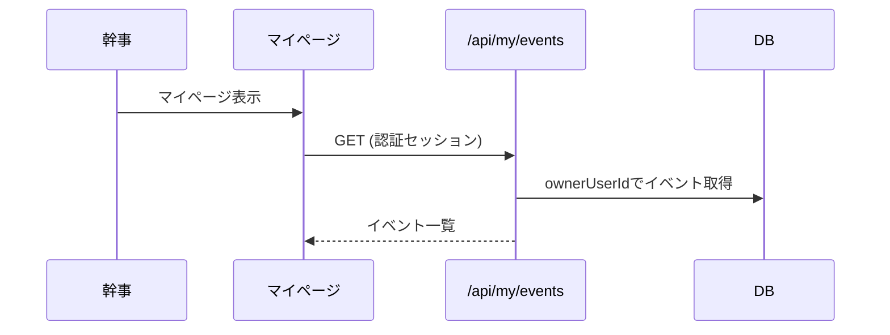

# デザインドキュメント：マイページイベント管理

---
目的: 幹事が作成イベントを一覧で把握し、管理画面へ素早く移動できるマイページを提供する。
---

## Overview
本機能は、ログイン済みの幹事に対して「自分が作成したイベント」を一覧表示するマイページを提供する。イベントの作成日時・候補日・確定日が一目で分かり、カードから管理画面へ遷移できる。未ログインの場合はヘッダーにログインボタンを表示し、マイページへの導線を置かない。

### Goals
- 幹事が作成イベントを一覧で確認できる
- クリックで管理画面へ移動できる
- 未ログイン時はログイン導線を表示する

### Non-Goals
- 参加者として参加したイベントの一覧
- プロフィール/通知/退会機能の実装

## Architecture

### Architecture Pattern & Boundary Map
- パターン: Next.js App Router + Route Handlers
- 境界: UI(マイページ) / API(イベント一覧) / DB(Prisma)
- 既存認証: Auth.js (JWTセッション)

```mermaid
flowchart LR
  UI[My Page UI] --> API[/api/my/events]
  API --> DB[(PostgreSQL)]
  API --> AUTH[Auth.js]
```

### Technology Stack

| Layer | Choice / Version | Role | Notes |
| --- | --- | --- | --- |
| Frontend | Next.js App Router | UI | TypeScript |
| Backend | Next.js Route Handlers | API | 同一リポ |
| Auth | Auth.js | 幹事認証 | JWT |
| Data | PostgreSQL + Prisma | 永続化 | Event, CandidateDate |

## System Flows



## Requirements Traceability

| Requirement | Summary | Components | Interfaces | Flows |
| --- | --- | --- | --- | --- |
| 1 | 目的 | MyPage UI | - | - |
| 2 | 対象ユーザー | Auth.js | - | - |
| 3 | 主要フロー | MyPage UI, MyEvents API | /api/my/events | Flow |
| 4 | 画面仕様 | MyPage UI | - | - |
| 5 | データ取得 | MyEvents API | /api/my/events | - |
| 7 | 例外/制約 | MyPage UI | - | - |
| 9 | グローバルヘッダー | Global Header | - | - |

## Components and Interfaces

| Component | Domain/Layer | Intent | Req Coverage | Key Dependencies | Contracts |
| --- | --- | --- | --- | --- | --- |
| MyPage | UI | 作成イベントの一覧表示 | 3,4,7 | MyEvents API | State |
| MyEvents API | API | ownerUserIdでイベント取得 | 5 | Prisma | API |
| Header | UI | ログイン/マイページ導線 | 7,9 | Auth.js | State |

### API Contract

| Method | Endpoint | Request | Response | Errors |
| --- | --- | --- | --- | --- |
| GET | /api/my/events | - | MyEvent[] | 401 |

Response `MyEvent`:
- id
- name
- createdAt
- publicId
- candidateDates[]
- confirmedCandidateDateId?

## Data Models

### Logical Data Model
- Event (id, ownerUserId, name, publicId, createdAt, confirmedCandidateDateId)
- CandidateDate (id, eventId, startsAt)

## Error Handling

### Error Strategy
- 未ログイン: 401 を返し、UI側はログインボタンを表示
- 取得失敗: 空状態またはエラー表示

## Testing Strategy

- Unit: イベント取得のフィルタ（ownerUserId）
- Integration: マイページでイベント一覧が表示される
- E2E: ログイン → マイページ → 管理画面遷移

## Security Considerations
- ownerUserId 一致のイベントのみ取得
- 非ログイン時の閲覧禁止
