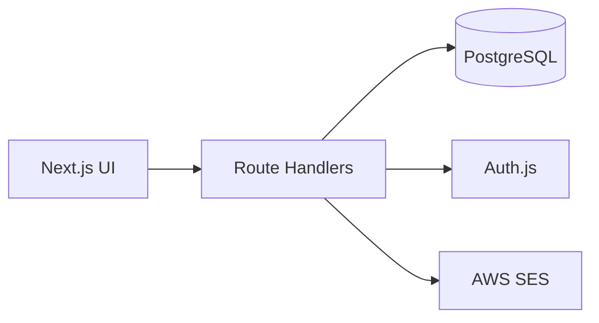
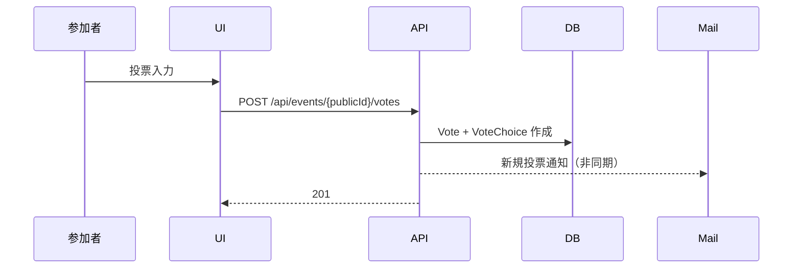
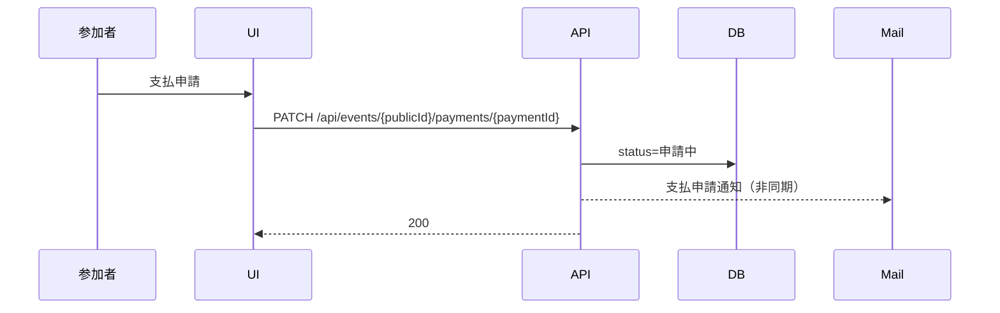
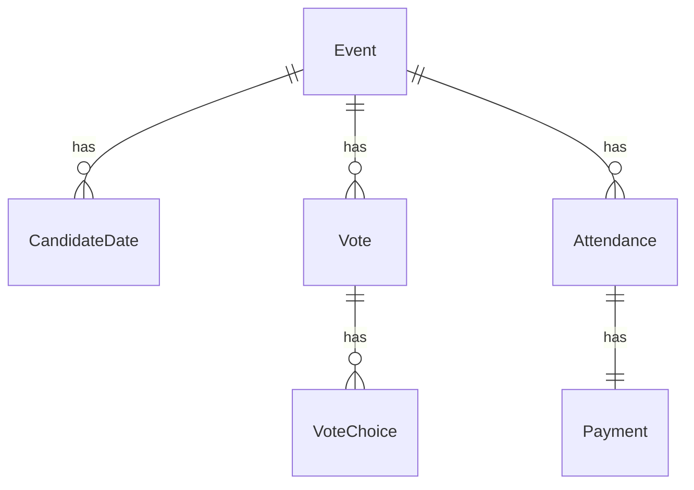
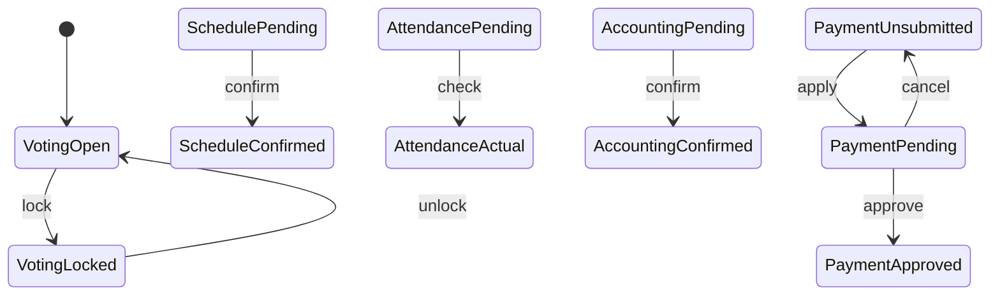

# デザインドキュメント：幹事向け飲み会管理サービス

---
目的: 実装の解釈差を防ぎ、状態遷移・権限・UI条件を一貫させる。
---

## Overview
本機能は、幹事が飲み会の「日程調整 → 出席管理 → 会計 → 支払申請・承認」を一貫して管理するためのWebサービスを提供する。参加者はログイン不要でイベントURLから利用し、幹事はログインした上でイベントを作成・管理する。  
投票や支払の操作条件は状態に強く依存するため、状態モデルを明確化し、UI表示・API制御の整合性を担保する。

### Goals
- 状態遷移に基づいた操作制限をUI/APIで一貫させる
- 匿名参加の前提で識別子と表示名を分離する
- 主要導線（投票→確定→出席→会計→支払）の実装指針を揃える

### Non-Goals
- システム内決済の実装
- 参加者間メッセージ機能
- モバイルアプリ化

## Architecture

### Architecture Pattern & Boundary Map
- パターン: Next.js App Router + Route Handlers のモノリポ構成
- 境界: UI/Server API/DB(Prisma) を同一リポジトリで分離
- 新規要素: Auth.js による幹事認証、SES 通知の非同期送信

### Technology Stack

| Layer | Choice / Version | Role | Notes |
| --- | --- | --- | --- |
| Frontend | Next.js App Router | UI/画面 | TypeScript |
| Backend | Next.js Route Handlers | API | 同一リポ |
| Auth | Auth.js | 幹事認証 | Credentials / Google |
| Data | PostgreSQL + Prisma | 永続化 | RDS |
| Mail | AWS SES | 通知 | 非同期送信 |
| Testing | Vitest / Playwright | Unit / E2E | 主要導線のみ |

## System Flows

### 投票フロー

### 支払申請フロー

## Requirements Traceability

| Requirement | Summary | Components | Interfaces | Flows |
| --- | --- | --- | --- | --- |
| R2 | 幹事ログイン/権限 | Auth, Event Admin | Auth.js, API | - |
| R5 | 投票/締切 | Vote UI, Vote API | /votes, /lock | 投票フロー |
| R7 | 日程確定 | Schedule UI/API | /schedule | - |
| R8 | 出席管理 | Attendance UI/API | /attendance | - |
| R10 | 会計管理 | Accounting UI/API | /accounting | - |
| R11 | 支払申請/承認 | Payment UI/API | /payments | 支払申請フロー |
| R12 | 支払通知 | Mailer | SES | 支払申請フロー |
| R14 | 権限ルール | Auth/Z | API Guard | - |

## Components and Interfaces

| Component | Domain/Layer | Intent | Req Coverage | Key Dependencies | Contracts |
| --- | --- | --- | --- | --- | --- |
| EventPublicPage | UI | 参加者向け投票/出席表示 | R5,R9 | Vote API | State |
| EventAdminPage | UI | 幹事向け管理 | R4,R7,R8,R10,R11,R13 | Auth, Admin APIs | State |
| VoteService | API | 投票CRUD | R5,R6 | DB, SES | API |
| ScheduleService | API | 日程確定 | R7 | DB | API |
| AttendanceService | API | 出席管理 | R8,R9 | DB | API |
| AccountingService | API | 会計管理 | R10 | DB | API |
| PaymentService | API | 支払申請/承認 | R11,R12,R13 | DB, SES | API |

### API Contract（主要）

| Method | Endpoint | Request | Response | Errors |
| --- | --- | --- | --- | --- |
| POST | /api/events | { name, memo?, candidates[] } | Event | 400,401 |
| GET | /api/events/{publicId} | - | EventPublic | 404 |
| POST | /api/events/{publicId}/votes | VoteInput | Vote | 400,403 |
| PATCH | /api/events/{publicId}/votes/{voteId} | VoteInput | Vote | 400,403,404 |
| DELETE | /api/events/{publicId}/votes/{voteId} | - | 204 | 403,404 |
| POST | /api/events/{publicId}/lock | { locked: boolean } | Event | 403 |
| POST | /api/events/{publicId}/schedule | { candidateDateId } | Event | 403,409 |
| POST | /api/events/{publicId}/attendance | { entries[] } | Attendance[] | 403 |
| POST | /api/events/{publicId}/accounting | { totalAmount, adjustments[] } | Accounting | 403,409 |
| PATCH | /api/events/{publicId}/payments/{paymentId} | { method, status } | Payment | 403,409 |
| POST | /api/events/{publicId}/payments/{paymentId}/approve | - | Payment | 403,409 |
| POST | /api/events/{publicId}/payments/{paymentId}/reject | - | Payment | 403,409 |

**認可ルール（API共通）**
- 参加者: publicIdを知るユーザーは投票/閲覧が可能
- 幹事: ownerUserId 一致で管理APIを許可（ログイン必須）
- イベント取得APIは isOwnerUser を返し、画面側で幹事リンク表示に利用する

## Data Models

### Domain Model
- Event が Vote/CandidateDate/Attendance/Payment を集約
- Vote は複数 CandidateDate に対する選択（VoteChoice）を持つ
- Attendance は確定日以降に実出席を表す
- Payment は Attendance と1対1

### Logical Data Model（主要フィールド）

- Event
  - id, publicId, name, memo
  - ownerUserId?, ownerClientId?
  - votingLocked(bool)
  - scheduleStatus(enum: pending/confirmed)
  - confirmedCandidateDateId?
  - accountingStatus(enum: pending/confirmed)
  - totalAmount?, perPersonAmount?
  - createdAt, updatedAt
- CandidateDate
  - id, eventId, startsAt
- Vote
  - id, eventId, name, comment?, createdAt, updatedAt
- VoteChoice
  - id, voteId, candidateDateId, response(enum: yes/maybe/no)
- Attendance
  - id, eventId, name
  - isConfirmed(bool), isActual(bool)
  - source(enum: vote/manual)
- Payment
  - id, eventId, attendanceId
  - amount, method(enum: cash/paypay/transfer/other)
  - status(enum: unsubmitted/pending/approved)
  - appliedAt?, approvedAt?

### State Model

| 対象 | 状態 | 遷移 | トリガー |
| --- | --- | --- | --- |
| 投票 | 受付中 / 締切 | 受付中 ↔ 締切 | 幹事が締切/解除 |
| 日程 | 未確定 / 確定 | 未確定 → 確定 | 幹事が確定日選択 |
| 出席 | 未確定 / 実出席 | 未確定 → 実出席 | 幹事がチェック |
| 会計 | 未確定 / 確定 | 未確定 → 確定 | 幹事が会計確定 |
| 支払 | 未申請 / 申請中 / 承認済み | 未申請 ↔ 申請中 → 承認済み | 参加者申請/取消、幹事承認 |

## UI / 画面構成

### ルーティング
- `/` 幹事ログイン/登録導線
- `/events/new` 幹事イベント作成
- `/e/[publicId]` 参加者向け（投票/出席一覧）
- `/e/[publicId]/admin` 幹事向け（締切/確定/会計/承認）

### 表示条件（横断）
- 投票締切時: 投票入力/編集/削除は非表示または禁止状態
- 日程未確定: 出席管理の編集は非表示
- 会計未確定: 支払申請ボタンは非表示（補足メッセージは表示しない）
- 幹事のみ: 会計入力・支払承認・締切/確定操作を表示
- 参加者のみ: 支払申請操作を表示（実出席者のみ）
- 参加者ページには幹事向けリンクを表示（イベント作成者のみ）
- 幹事ページには参加者ページへのリンクを表示
- 支払管理の承認/差し戻しは申請中のみ表示
- 日程候補と投票一覧は統合テーブルで表示（縦=候補日、横=投票者）
- 投票フォームはトグルで開閉でき、デフォルトは✕で初期化する
- 投票表は◯を緑太字、✕を赤で強調する
- 出席管理・会計・支払管理は日程確定後に表示する
- 参加者ページの出席一覧は日程確定後に表示する
- 参加者/幹事ページに参加者URLとコピー機能を表示する
- 日程候補の編集はトグルで開閉し、デフォルトは閉じた状態とする

## Error Handling

### Error Strategy
- 状態不整合は 409（例: 会計未確定で支払申請）
- 権限不足は 403（幹事限定操作）
- 未存在リソースは 404

### Monitoring
- 通知送信失敗はログに残し、主要フローは成功させる

## Testing Strategy

- Unit: 状態遷移、均等割り切り上げ、支払ステータス制御
- Integration: 投票作成→通知送信、会計確定→支払申請可否
- E2E: 投票→確定→出席→会計→申請→承認の主要導線

## Implementation Notes

- セッションは JWT 方式で運用し、/api/auth/session を安定させる。
- 参加者ページの出席一覧に支払申請 UI を表示（会計確定後・実出席者のみ）。
- 支払管理の承認/差し戻しは申請中のみ表示する。
- 投票/支払申請の通知は SES で非同期送信（失敗しても主要フローは継続）。
- ローカル環境ではメール送信をスキップし、ログ出力のみ行う。
- Googleログインは環境変数未設定時は無効（未検証）。
- テストは未整備のため、実装確認は手動で行う。
- 投票編集は一覧の名前クリックから遷移し、フォーム内に削除ボタンを配置する。
- 投票トグルの文言は「投票する/閉じる」で開閉状態を示す。

## Security Considerations

- 幹事操作は Auth.js セッションで保護
- publicId は推測困難な識別子を使用
- 参加者投票の編集は仕様として無制限（認可しない）

## Performance & Scalability

- 通知は非同期送信でレイテンシを抑制
- 一覧表示は eventId をキーにページングなしの想定（MVP）

## Open Decisions / Clarifications（実装ブレ防止）

### Payment識別子の扱い（参加者導線）
参加者はログイン不要のため paymentId を外部入力に依存しない。
MVPでは方式Aで確定する。

- A（採用）: 申請APIは attendanceId ベース
  - POST /api/events/{publicId}/payments/apply { attendanceId, method }
  - POST /api/events/{publicId}/payments/cancel { attendanceId }
- B: イベント取得レスポンスで paymentId を配布し、PATCH /payments/{paymentId} を利用（不採用）

### 投票編集のセキュリティ前提
投票の編集・削除は仕様として publicId を知る任意ユーザーに許可する。
改ざん耐性（本人性担保・編集制限）はMVP対象外とし、監査や復旧機能も持たない。

### ownerClientId の生成と保持
- ブラウザ初回アクセス時に `client_id` を生成し localStorage に保持する
- Event作成時に ownerClientId として保存する
- 管理APIは `ownerUserId` 一致 または `ownerClientId` 一致で許可する

### 日程確定後の参加者リスト生成ルール
- 確定日はMVPでは変更不可（再確定は 409）
- Attendance の自動生成対象は source=vote のみ
- 飛び入り参加者は source=manual として保存し、自動生成とは独立して扱う
