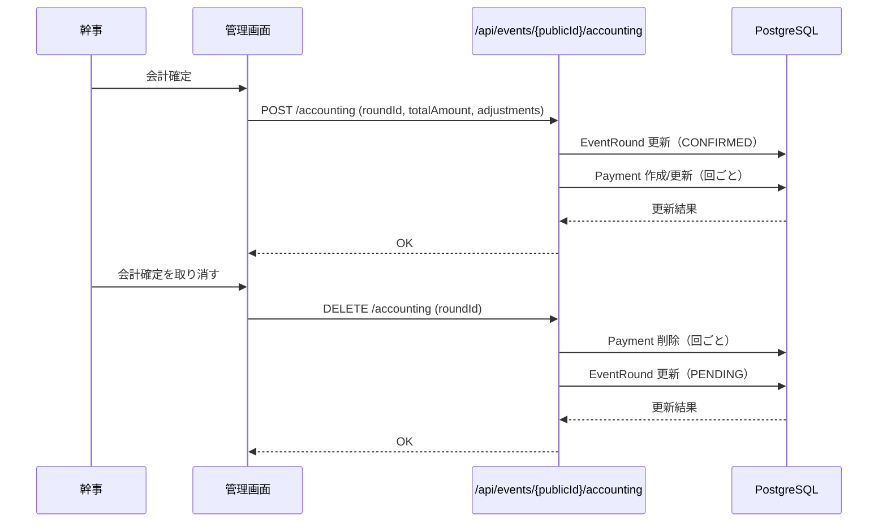

# 会計確定/取消フロー

```mermaid
sequenceDiagram
  participant A as 幹事
  participant UI as 管理画面
  participant API as /api/events/{publicId}/accounting
  participant DB as PostgreSQL

  A->>UI: 会計確定
  UI->>API: POST /accounting (roundId, totalAmount, adjustments)
  API->>DB: EventRound 更新（CONFIRMED）
  API->>DB: Payment 作成/更新（回ごと）
  DB-->>API: 更新結果
  API-->>UI: OK

  A->>UI: 会計確定を取り消す
  UI->>API: DELETE /accounting (roundId)
  API->>DB: Payment 削除（回ごと）
  API->>DB: EventRound 更新（PENDING）
  DB-->>API: 更新結果
  API-->>UI: OK
```
