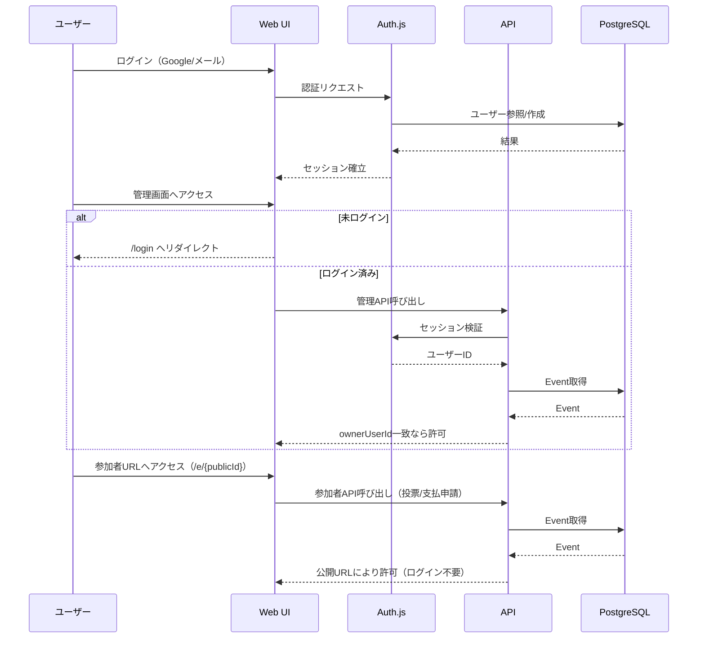

# 認証・認可フロー

```mermaid
sequenceDiagram
  participant U as ユーザー
  participant UI as Web UI
  participant Auth as Auth.js
  participant API as API
  participant DB as PostgreSQL

  U->>UI: ログイン（Google/メール）
  UI->>Auth: 認証リクエスト
  Auth->>DB: ユーザー参照/作成
  DB-->>Auth: 結果
  Auth-->>UI: セッション確立

  U->>UI: 管理画面へアクセス
  alt 未ログイン
    UI-->>U: /login へリダイレクト
  else ログイン済み
    UI->>API: 管理API呼び出し
    API->>Auth: セッション検証
    Auth-->>API: ユーザーID
    API->>DB: Event取得
    DB-->>API: Event
    API-->>UI: ownerUserId一致なら許可
  end

  U->>UI: 参加者URLへアクセス（/e/{publicId}）
  UI->>API: 参加者API呼び出し（投票/支払申請）
  API->>DB: Event取得
  DB-->>API: Event
  API-->>UI: 公開URLにより許可（ログイン不要）
```
