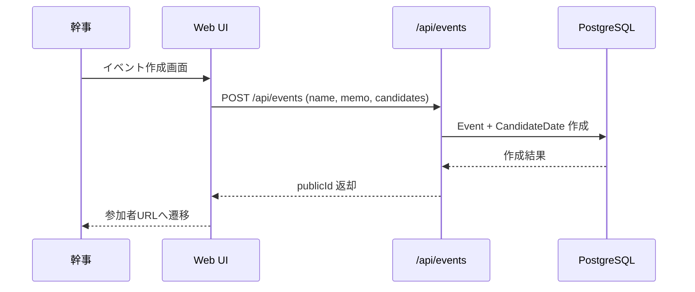

# イベント作成フロー

```mermaid
sequenceDiagram
  participant A as 幹事
  participant UI as Web UI
  participant API as /api/events
  participant DB as PostgreSQL

  A->>UI: イベント作成画面
  UI->>API: POST /api/events (name, memo, candidates)
  API->>DB: Event + CandidateDate 作成
  DB-->>API: 作成結果
  API-->>UI: publicId 返却
  UI-->>A: 参加者URLへ遷移
```
