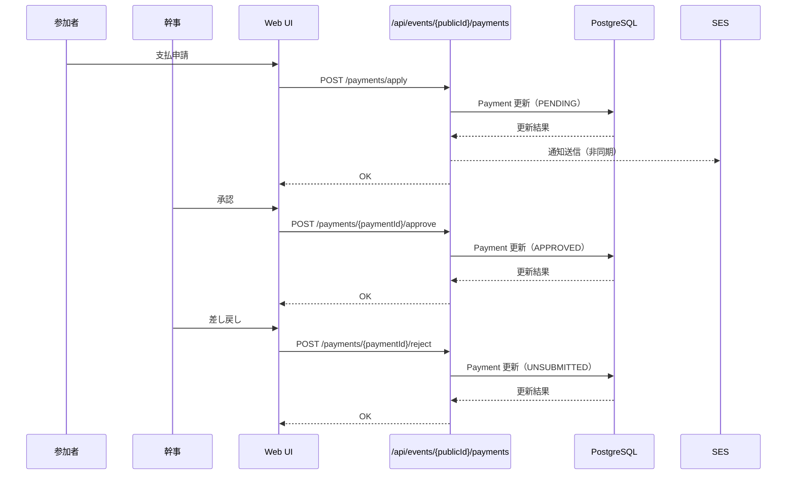

# 支払申請/承認フロー

```mermaid
sequenceDiagram
  participant P as 参加者
  participant A as 幹事
  participant UI as Web UI
  participant API as /api/events/{publicId}/payments
  participant DB as PostgreSQL
  participant Mail as SES

  P->>UI: 支払申請
  UI->>API: POST /payments/apply
  API->>DB: Payment 更新（PENDING）
  DB-->>API: 更新結果
  API-->>Mail: 通知送信（非同期）
  API-->>UI: OK

  A->>UI: 承認
  UI->>API: POST /payments/{paymentId}/approve
  API->>DB: Payment 更新（APPROVED）
  DB-->>API: 更新結果
  API-->>UI: OK

  A->>UI: 差し戻し
  UI->>API: POST /payments/{paymentId}/reject
  API->>DB: Payment 更新（UNSUBMITTED）
  DB-->>API: 更新結果
  API-->>UI: OK
```
