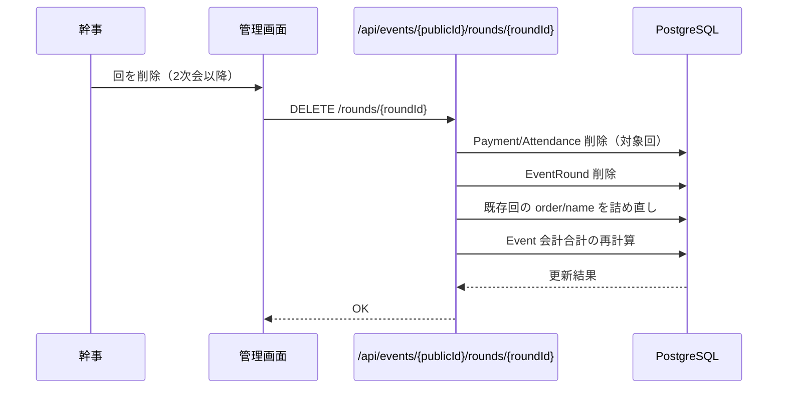

# 回削除フロー

```mermaid
sequenceDiagram
  participant A as 幹事
  participant UI as 管理画面
  participant API as /api/events/{publicId}/rounds/{roundId}
  participant DB as PostgreSQL

  A->>UI: 回を削除（2次会以降）
  UI->>API: DELETE /rounds/{roundId}
  API->>DB: Payment/Attendance 削除（対象回）
  API->>DB: EventRound 削除
  API->>DB: 既存回の order/name を詰め直し
  API->>DB: Event 会計合計の再計算
  DB-->>API: 更新結果
  API-->>UI: OK
```
