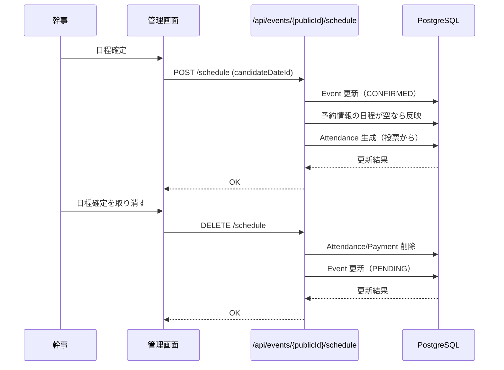

# 日程確定/取消フロー

```mermaid
sequenceDiagram
  participant A as 幹事
  participant UI as 管理画面
  participant API as /api/events/{publicId}/schedule
  participant DB as PostgreSQL

  A->>UI: 日程確定
  UI->>API: POST /schedule (candidateDateId)
  API->>DB: Event 更新（CONFIRMED）
  API->>DB: 予約情報の日程が空なら反映
  API->>DB: Attendance 生成（投票から）
  DB-->>API: 更新結果
  API-->>UI: OK

  A->>UI: 日程確定を取り消す
  UI->>API: DELETE /schedule
  API->>DB: Attendance/Payment 削除
  API->>DB: Event 更新（PENDING）
  DB-->>API: 更新結果
  API-->>UI: OK
```
