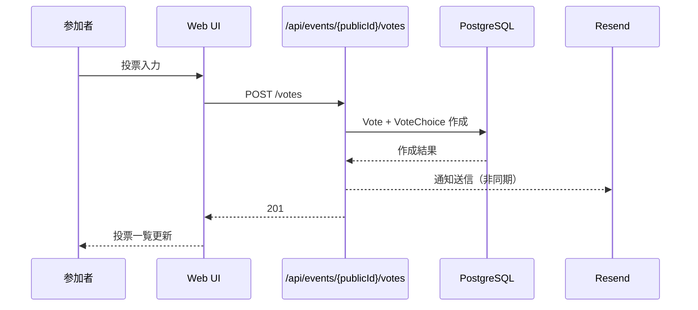

# 投票フロー

```mermaid
sequenceDiagram
  participant P as 参加者
  participant UI as Web UI
  participant API as /api/events/{publicId}/votes
  participant DB as PostgreSQL
  participant Mail as Resend

  P->>UI: 投票入力
  UI->>API: POST /votes
  API->>DB: Vote + VoteChoice 作成
  DB-->>API: 作成結果
  API-->>Mail: 通知送信（非同期）
  API-->>UI: 201
  UI-->>P: 投票一覧更新
```
