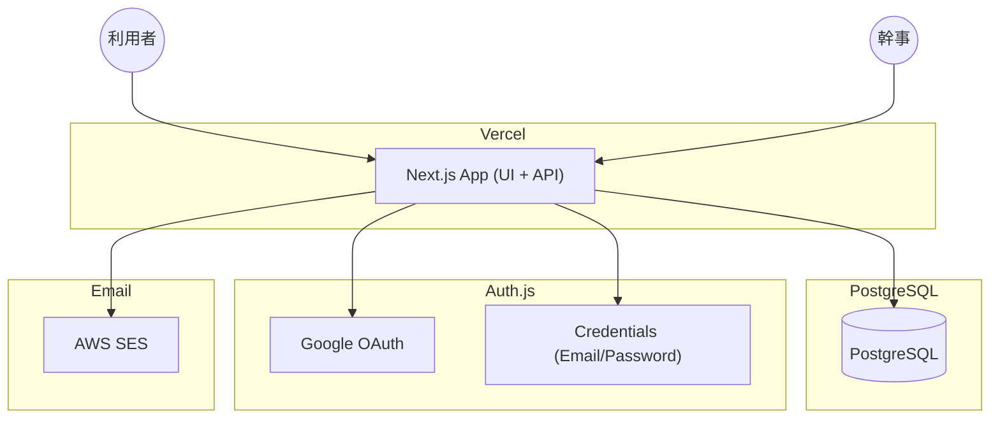

# インフラ構成図

```mermaid
flowchart TB
  user((利用者))
  admin((幹事))

  subgraph Vercel["Vercel"]
    web["Next.js App (UI + API)"]
  end

  subgraph DB["PostgreSQL"]
    pg[(PostgreSQL)]
  end

  subgraph Auth["Auth.js"]
    oauth["Google OAuth"]
    cred["Credentials (Email/Password)"]
  end

  subgraph Mail["Email"]
    ses["AWS SES"]
  end

  user --> web
  admin --> web
  web --> pg
  web --> oauth
  web --> cred
  web --> ses
```
