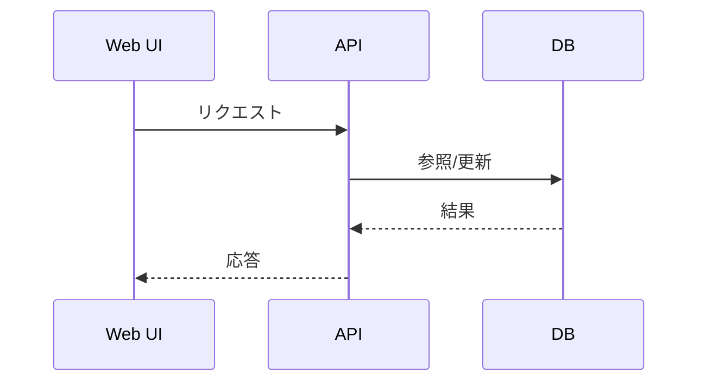
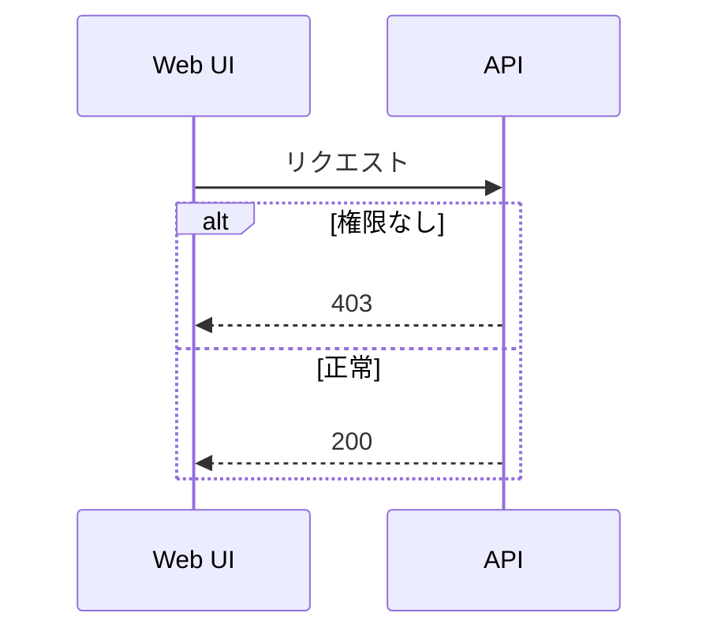

# 図の記法ガイド

このプロジェクトの Mermaid 図で使う矢印や粒度の目安です。

## 基本ルール
- 図は「処理の流れ」と「責務の境界」を伝えることを優先する
- 詳細すぎる実装手順は書かない（関数名/内部処理は省略）
- 例外系は代表的なものだけに絞る

## 矢印の意味
### sequenceDiagram
- `A->>B`: 同期リクエスト（通常フロー）
- `A-->>B`: 応答/返却
- `A->>+B`: 処理開始（ライフライン表示を強調したい場合）
- `A-->>-B`: 処理終了

### flowchart
- `A --> B`: 通常のデータ/処理の流れ
- `A -.-> B`: 参照/補助的な関係（任意フローや依存）
- `A -->|条件| B`: 条件付きの遷移

## 粒度の目安
- **主要機能フロー**: UI → API → DB/外部サービスの単位
- **構成図**: デプロイ/外部依存の境界（Vercel, DB, SES, OAuth）
- **詳細処理**: 1機能につき 6〜10ステップ以内に収める

## 例（参考）



## 例外系の表現
- 例外は **1〜2件** に絞り、主要フローの邪魔をしない位置に置く
- `note over` を使って補足する



## 色分けルール（任意）
- 使う場合は **3色まで** に限定
- 例: 成功（緑）、注意（橙）、失敗（赤）

```mermaid
flowchart LR
  classDef ok fill:#e8f5ea,stroke:#5fa85a,color:#1f1b16;
  classDef warn fill:#fff4e9,stroke:#f0b37e,color:#1f1b16;
  classDef err fill:#ffecec,stroke:#d14c4c,color:#1f1b16;
```

## 命名規則
- 参加者: `P`、幹事: `A`
- UI: `UI`、API: `API`、DB: `DB`
- 外部サービス: `SES` / `OAuth`
